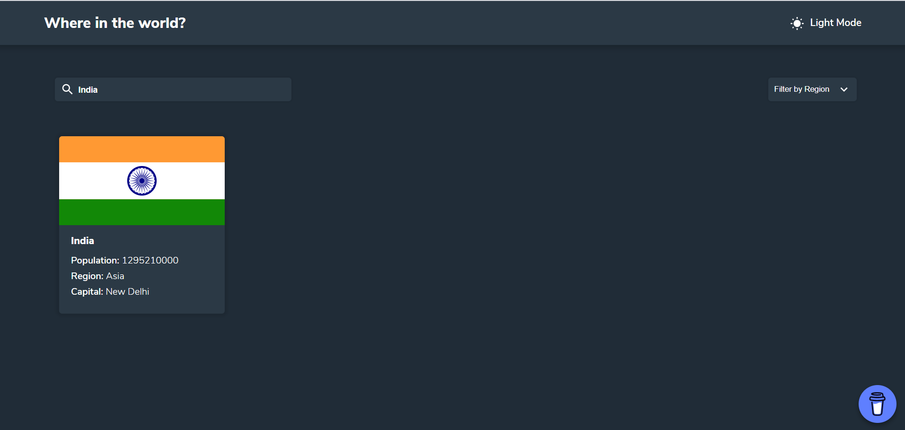

# Fetch Countries Data developed using React JS

We will fetch the countries data from [Rest Countries API](https://restcountries.eu/rest/v2/all)

We should be able to do the following

- See all countries from the API on the homepage
- Search for a country using an input field
- Filter countries by region
- Click on a country to see more detailed information on a separate page
- Click through to the border countries on the detail page
- Toggle the color scheme between light and dark mode (optional)

[Live Demo](https://praveenoruganti-countries.firebaseapp.com/)

